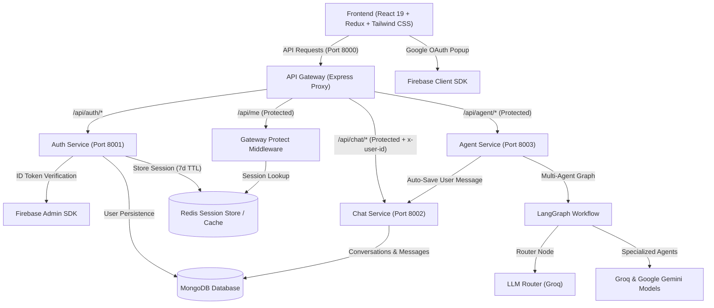
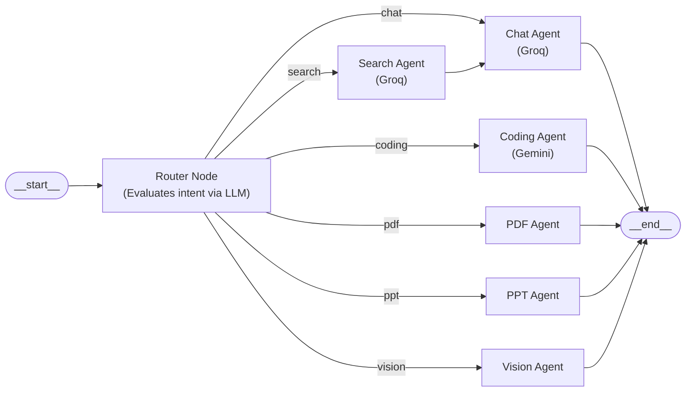

# 🧠 Cortex AI

An intelligent, enterprise-grade, microservices-driven AI platform built with modern web technologies, scalable distributed architecture, LangGraph multi-agent orchestration, and secure session management.

---

## 📌 Project Overview

**Cortex AI** is an advanced AI assistant and multi-agent execution platform designed around an asynchronous, decoupled microservices architecture. It features:
- **Centralized API Gateway:** Single entry point handling CORS, request logging, session authentication, and proxy routing with user identity injection (`x-user-id`).
- **Distributed Session Authentication:** Firebase Admin verification paired with secure Redis sessions (7-day TTL) and HTTP-only cookies.
- **Dedicated Chat Service:** MongoDB-backed conversation and message persistence, managing chat histories and thread metadata.
- **LangGraph Multi-Agent Orchestration:** Dynamic prompt routing using `@langchain/langgraph` to dispatch tasks to specialized agent nodes (Chat, Coding, Search, PDF, PPT, Vision) powered by Groq and Google Gemini models.

---

## 🏗️ System Architecture



---

## 🤖 LangGraph Multi-Agent Workflow

The **Agent Service** utilizes `@langchain/langgraph` StateGraph to dynamically classify user intent and route execution to specialized nodes:



### Supported Specialized Agents & Models
| Agent Node | Responsibility | Model Provider / Engine |
| :--- | :--- | :--- |
| **Router** | Intent classification and routing decision | Groq (`openai/gpt-oss-120b`) |
| **Chat** | General discussion, Q&A, reasoning, learning | Groq (`openai/gpt-oss-120b`) |
| **Search** | Real-time web knowledge, recent events, lookups | Groq (`openai/gpt-oss-120b`) -> Chat Agent |
| **Coding** | Code generation, debugging, refactoring, architecture | Google Gemini (`gemini-2.5-flash`) |
| **PDF** | Document context analysis and PDF synthesis | Custom Agent Pipeline |
| **PPT** | Presentation deck outline and slide generation | Custom Agent Pipeline |
| **Vision** | Visual synthesis and multimodal image handling | Multimodal AI Pipeline |

---

## 🚀 Tech Stack

### **Frontend**
- **Framework:** [React 19](https://react.dev/) + [Vite](https://vitejs.dev/)
- **State Management:** [Redux Toolkit](https://redux-toolkit.js.org/) + [React Redux](https://react-redux.js.org/)
- **Styling:** [Tailwind CSS v4](https://tailwindcss.com/)
- **Icons:** [React Icons](https://react-icons.github.io/react-icons/)
- **Auth Client:** [Firebase Authentication](https://firebase.google.com/) (Google OAuth popup flow)
- **HTTP Client:** [Axios](https://axios-http.com/) (configured with `withCredentials: true`)

### **Backend & Microservices**
- **Runtime:** [Node.js](https://nodejs.org/) (ES Modules)
- **Framework:** [Express.js](https://expressjs.com/)
- **API Gateway:** Reverse proxy routing via `express-http-proxy` with custom header decorator (`proxyWithHeader`)
- **Agent Orchestration:** [LangGraph](https://langchain-ai.github.io/langgraphjs/) (`@langchain/langgraph`), `@langchain/core`
- **LLM Integrations:** `@langchain/groq` (Groq), `@langchain/google-genai` (Google Gemini)
- **Database & ODM:** [MongoDB](https://www.mongodb.com/) via [Mongoose](https://mongoosejs.com/)
- **Session Management & Cache:** [Redis](https://redis.io/) via `ioredis` (Dockerized)
- **Authentication & Security:** Firebase Admin SDK, HTTP-only secure cookie sessions, CORS, `cookie-parser`
- **Logging:** `morgan`

---

## 📂 Project Structure

```text
cortex_ai/
├── backend/
│   ├── docker-compose.yml          # Docker Compose for Redis (Port 6379)
│   ├── package.json
│   ├── gateway/                    # API Gateway (Reverse Proxy & Auth Validation)
│   │   ├── controllers/
│   │   │   └── user.controller.js  # Current user profile controller (/api/me)
│   │   ├── middleware/
│   │   │   └── auth.middleware.js  # Redis session validation middleware
│   │   ├── utils/
│   │   │   └── proxyWithHeader.js  # Injects authenticated x-user-id downstream
│   │   ├── index.js                # Gateway entry point & route definitions
│   │   ├── .env                    # Gateway configuration
│   │   └── package.json
│   ├── services/
│   │   ├── auth/                   # Authentication Microservice (Port 8001)
│   │   │   ├── config/             # MongoDB connection & Firebase Admin setup
│   │   │   ├── controllers/        # Login/Logout & session handling logic
│   │   │   ├── models/             # User Mongoose Schema
│   │   │   ├── routes/             # Auth routes (/api/auth/login, /logout)
│   │   │   ├── serviceAccountKey.json # Firebase Admin credentials
│   │   │   ├── index.js            # Auth service entry point
│   │   │   └── package.json
│   │   ├── chat/                   # Chat & History Microservice (Port 8002)
│   │   │   ├── config/             # MongoDB connection
│   │   │   ├── controllers/        # Conversation & message controllers
│   │   │   ├── models/             # Conversation & Message Mongoose Schemas
│   │   │   ├── routes/             # Chat routes (create, get, update, save)
│   │   │   ├── index.js            # Chat service entry point
│   │   │   └── package.json
│   │   └── agent/                  # Multi-Agent Microservice (Port 8003)
│   │       ├── agents/             # Individual agent nodes (chat, coding, etc.)
│   │       ├── config/             # MongoDB & dynamic LLM model selector
│   │       ├── controllers/        # Agent controller (invokes LangGraph)
│   │       ├── graph/              # LangGraph workflow, router, and state
│   │       │   ├── graph.js        # StateGraph compile & workflow edges
│   │       │   ├── router.js       # Dynamic intent routing logic
│   │       │   └── state.js        # LangGraph State definition
│   │       ├── routes/             # Agent routes (/chat)
│   │       ├── index.js            # Agent service entry point
│   │       └── package.json
│   └── shared/
│       └── redis/
│           └── redis.js            # Shared Redis connection client (ioredis)
├── frontend/                       # React 19 + Vite client application
│   ├── src/
│   │   ├── features/
│   │   │   └── getCurrentUser.js   # Session fetch utility (/api/me)
│   │   ├── pages/
│   │   │   └── home.jsx            # Home dashboard & Google login modal
│   │   ├── redux/
│   │   │   ├── store.js            # Redux store configuration
│   │   │   └── userSlice.js        # User state & authentication slice
│   │   ├── App.jsx                 # App root & session hydration on mount
│   │   ├── main.jsx                # React DOM root with Redux Provider
│   │   └── index.css               # Global styling (Tailwind CSS v4)
│   ├── utils/
│   │   ├── axios.js                # Axios client instance (withCredentials: true)
│   │   └── firebase.js             # Firebase client SDK initialization
│   ├── .env                        # Frontend environment variables
│   ├── package.json
│   └── vite.config.js
└── README.md
```

---

## ⚡ Current Features & Implementation Status

### ✅ Implemented
- [x] **API Gateway:** Centralized routing with CORS, request logging (`morgan`), cookie parsing, and reverse proxying.
- [x] **Downstream Header Injection:** Automatic `x-user-id` forwarding to internal services via `proxyWithHeader`.
- [x] **Google OAuth via Firebase:** Frontend popup authentication generating Firebase ID tokens.
- [x] **Backend Auth Verification:** Firebase Admin SDK token verification on the Auth microservice.
- [x] **User Onboarding & Persistence:** Automatic lookup or creation of user profiles in MongoDB.
- [x] **Distributed Session Management:** Secure UUID-based session keys stored in Redis with 7-day TTL (`session:<sessionID>`) and HTTP-only cookies.
- [x] **Gateway Authentication Middleware (`protect`):** Direct Redis session validation at the Gateway layer to protect downstream routes.
- [x] **Session Hydration & Global State:** Redux Toolkit integration auto-fetching `/api/me` on application load to maintain login state across refreshes.
- [x] **Logout Flow:** Immediate session invalidation in Redis and cookie clearing.
- [x] **Chat Microservice:** Full conversation lifecycle (creation, title renaming, listing by user, and thread message persistence).
- [x] **LangGraph Multi-Agent Architecture:** Compiled `StateGraph` with prompt routing to specialized agent nodes.
- [x] **Multi-LLM Provider Switching:** Dynamic model selector supporting Groq (`openai/gpt-oss-120b`) and Google Gemini (`gemini-2.5-flash`).
- [x] **Automatic Message Synchronization:** Agent microservice auto-saves prompt messages into the Chat Service before execution.
- [x] **Dockerized Redis:** Containerized Redis service orchestrated with Docker Compose.

### 🔄 In Progress / Roadmap
- [ ] **Frontend Chat Interface:** Sidebar conversation switcher, markdown formatting, code syntax highlighting, and dark mode UI.
- [ ] **Agent Streaming:** Server-Sent Events (SSE) or WebSockets for real-time token streaming from LangGraph.
- [ ] **Coding Agent Execution Sandbox:** Isolated code evaluation environment.
- [ ] **PDF & PPT Agent Implementations:** Generation of downloadable documents and slide decks.
- [ ] **Full Multi-Service Dockerization:** Complete multi-container orchestration for all backend microservices.

---

## 🛠️ Getting Started

### Prerequisites
- [Node.js (v18+)](https://nodejs.org/)
- [Docker & Docker Desktop](https://www.docker.com/) (for Redis)
- [MongoDB](https://www.mongodb.com/) (Local instance or MongoDB Atlas URI)
- [Firebase Project](https://console.firebase.google.com/) with Google Sign-In enabled & Firebase Service Account Key
- [Groq API Key](https://console.groq.com/) & [Google AI Gemini API Key](https://aistudio.google.com/)

---

### 1. Start Redis Container

From the `backend` directory, spin up the Redis container:
```bash
cd backend
docker compose up -d
```

---

### 2. Environment Variables Configuration

Create `.env` files in their respective folders:

#### 🔹 API Gateway (`backend/gateway/.env`)
```env
PORT=8000
FRONTEND_URL=http://localhost:5173
AUTH_SERVICE=http://localhost:8001
CHAT_SERVICE=http://localhost:8002
AGENT_SERVICE=http://localhost:8003
REDIS_URL=redis://localhost:6379
```

#### 🔹 Auth Service (`backend/services/auth/.env`)
```env
PORT=8001
MONGO_URI=your_mongodb_connection_string
REDIS_URL=redis://localhost:6379
```
> Place your Firebase service account JSON file as `serviceAccountKey.json` inside `backend/services/auth/`.

#### 🔹 Chat Service (`backend/services/chat/.env`)
```env
PORT=8002
MONGO_URI=your_mongodb_connection_string
```

#### 🔹 Agent Service (`backend/services/agent/.env`)
```env
PORT=8003
MONGO_URI=your_mongodb_connection_string
GROQ_API_KEY=your_groq_api_key
GOOGLE_API_KEY=your_google_gemini_api_key
CHAT_SERVICE=http://localhost:8002
```

#### 🔹 Frontend (`frontend/.env`)
```env
VITE_SERVER_URL=http://localhost:8000
VITE_FIREBASE_API_KEY=your_firebase_api_key
VITE_FIREBASE_AUTH_DOMAIN=your_project.firebaseapp.com
VITE_FIREBASE_PROJECT_ID=your_project_id
VITE_FIREBASE_STORAGE_BUCKET=your_project.appspot.com
VITE_FIREBASE_MESSAGING_SENDER_ID=your_sender_id
VITE_FIREBASE_APP_ID=your_app_id
```

---

### 3. Running Services Locally

Run each service in separate terminal windows:

```bash
# Terminal 1: Redis (Docker)
cd backend
docker compose up -d

# Terminal 2: API Gateway (Port 8000)
cd backend/gateway
npm install
npm run dev

# Terminal 3: Auth Service (Port 8001)
cd backend/services/auth
npm install
npm run dev

# Terminal 4: Chat Service (Port 8002)
cd backend/services/chat
npm install
npm run dev

# Terminal 5: Agent Service (Port 8003)
cd backend/services/agent
npm install
npm run dev

# Terminal 6: Frontend Client (Port 5173)
cd frontend
npm install
npm run dev
```

---

## 📡 API Endpoints Reference

### **1. API Gateway & Auth Routes**
| Method | Endpoint | Description | Protected |
| :--- | :--- | :--- | :---: |
| `GET` | `/` | Gateway health check | ❌ |
| `GET` | `/api/me` | Validates session in Redis and returns current user profile | ✅ (Cookie) |
| `POST` | `/api/auth/login` | Verifies Firebase ID token, creates/finds user in MongoDB, sets 7-day Redis session cookie | ❌ |
| `GET` | `/api/auth/logout` | Deletes Redis session key and clears session cookie | ✅ (Cookie) |

### **2. Chat Service Routes**
*(Routed via Gateway `/api/chat/*` with automatic `x-user-id` header injection)*

| Method | Endpoint | Description | Protected |
| :--- | :--- | :--- | :---: |
| `GET` | `/api/chat/create-conversation` | Creates a new conversation thread for the authenticated user | ✅ |
| `GET` | `/api/chat/get-conversations` | Fetches all conversations belonging to the user (sorted newest first) | ✅ |
| `POST` | `/api/chat/update-conversation` | Updates conversation title (`{ id, title }`) | ✅ |
| `POST` | `/api/chat/save-message` | Saves a message in a conversation (`{ conversationId, role, content }`) | ✅ |
| `GET` | `/api/chat/get-messages/:conversationId` | Fetches all message history for a specific conversation thread | ✅ |

### **3. Agent Service Routes**
*(Routed via Gateway `/api/agent/*`)*

| Method | Endpoint | Description | Protected |
| :--- | :--- | :--- | :---: |
| `POST` | `/api/agent/chat` | Auto-saves user prompt to Chat Service, runs LangGraph router & specialized agent, and returns AI response | ✅ |

---

## 📄 License

This project is licensed for development and educational use.
