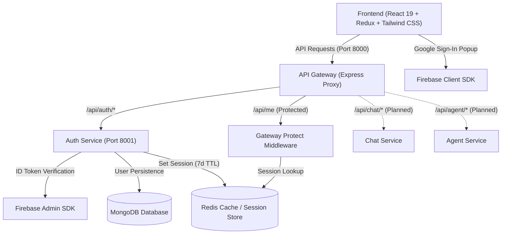

# 🧠 Cortex AI

An intelligent, microservices-driven AI platform built with modern web technologies, scalable distributed architecture, and secure session authentication.

---

## 📌 Project Overview

**Cortex AI** is designed as a modular, scalable AI assistant platform. It uses an **API Gateway** as the single entry point to route traffic to independent microservices (Authentication, Chat, and Agents), with distributed session management powered by **Redis** and **MongoDB** for persistent storage.

> **Status:** 🚧 **Active Development**

---

## 🏗️ System Architecture



---

## 🚀 Tech Stack

### **Frontend**
- **Framework:** [React 19](https://react.dev/) + [Vite](https://vitejs.dev/)
- **State Management:** [Redux Toolkit](https://redux-toolkit.js.org/) + [React Redux](https://react-redux.js.org/)
- **Styling:** [Tailwind CSS v4](https://tailwindcss.com/)
- **Icons:** [React Icons](https://react-icons.github.io/react-icons/)
- **Auth Client:** [Firebase Authentication](https://firebase.google.com/) (Google OAuth popup flow)
- **HTTP Client:** [Axios](https://axios-http.com/) (configured with `withCredentials: true`)

### **Backend & Microservices**
- **Runtime:** [Node.js](https://nodejs.org/) (ES Modules)
- **Framework:** [Express.js](https://expressjs.com/)
- **API Gateway:** Reverse proxy routing via `express-http-proxy`
- **Database & ODM:** [MongoDB](https://www.mongodb.com/) via [Mongoose](https://mongoosejs.com/)
- **Session Management & Cache:** [Redis](https://redis.io/) via `ioredis` (Dockerized)
- **Authentication & Security:** Firebase Admin SDK, HTTP-only secure cookie sessions, CORS, `cookie-parser`
- **Logging:** `morgan`

---

## 📂 Project Structure

```text
cortex_ai/
├── backend/
│   ├── docker-compose.yml          # Docker compose for Redis (Port 6379)
│   ├── package.json
│   ├── gateway/                    # API Gateway (Reverse Proxy & Auth Validation)
│   │   ├── controllers/
│   │   │   └── user.controller.js  # Current user profile controller (/api/me)
│   │   ├── middleware/
│   │   │   └── auth.middleware.js  # Session validation middleware via Redis
│   │   ├── index.js                # Gateway entry point & route definitions
│   │   ├── .env                    # Gateway environment variables
│   │   └── package.json
│   ├── services/
│   │   ├── auth/                   # Authentication Microservice
│   │   │   ├── config/             # MongoDB connection & Firebase Admin setup
│   │   │   ├── controllers/        # Login/Logout & session handling logic
│   │   │   ├── models/             # User Mongoose Schema
│   │   │   ├── routes/             # Auth route definitions (/login, /logout)
│   │   │   ├── index.js            # Auth service entry point
│   │   │   ├── .env                # Auth service configuration
│   │   │   ├── serviceAccountKey.json # Firebase Admin service credentials
│   │   │   └── package.json
│   │   ├── chat/                   # (Planned) Real-time chat microservice
│   │   └── agent/                  # (Planned) AI agent execution microservice
│   └── shared/
│       └── redis/
│           └── redis.js            # Shared Redis connection client (ioredis)
├── frontend/                       # React 19 + Vite client application
│   ├── src/
│   │   ├── features/
│   │   │   └── getCurrentUser.js   # Session fetch utility (/api/me)
│   │   ├── pages/
│   │   │   └── home.jsx            # Home dashboard & Google login modal
│   │   ├── redux/
│   │   │   ├── store.js            # Redux store configuration
│   │   │   └── userSlice.js        # User state & authentication slice
│   │   ├── App.jsx                 # App root & session hydration on mount
│   │   ├── main.jsx                # React DOM root with Redux Provider
│   │   └── index.css               # Global styling (Tailwind CSS v4)
│   ├── utils/
│   │   ├── axios.js                # Axios client instance (withCredentials: true)
│   │   └── firebase.js             # Firebase client SDK initialization
│   ├── .env                        # Frontend environment variables
│   ├── package.json
│   └── vite.config.js
└── README.md
```

---

## ⚡ Current Features & Implementation Status

### ✅ Implemented
- [x] **API Gateway:** Centralized routing with CORS, request logging (`morgan`), cookie parsing, and proxying.
- [x] **Google OAuth via Firebase:** Frontend popup authentication generating Firebase ID tokens.
- [x] **Backend Auth Verification:** Firebase Admin SDK token verification on the Auth microservice.
- [x] **User Onboarding & Persistence:** Automatic lookup or creation of user profiles in MongoDB.
- [x] **Distributed Session Management:** Secure UUID-based session keys stored in Redis with 7-day TTL (`session:<sessionID>`) and HTTP-only cookies.
- [x] **Gateway Authentication Middleware (`protect`):** Direct Redis session validation at the Gateway layer to protect downstream routes.
- [x] **Session Hydration & Global State:** Redux Toolkit integration auto-fetching `/api/me` on application load to maintain login state across refreshes.
- [x] **Logout Flow:** Immediate session invalidation in Redis and cookie clearing.
- [x] **Dockerized Redis:** Containerized Redis service orchestrated with Docker Compose.

### 🔄 In Progress / Roadmap
- [ ] **Chat Service:** Real-time conversational AI workflows and history persistence.
- [ ] **Agent Service:** Multi-agent autonomous task execution and tool use.
- [ ] **Frontend Chat Interface:** Sidebar navigation, model selector, chat streams, and dark-themed UI.
- [ ] **Microservices Dockerization:** Complete multi-container orchestration for all services.

---

## 🛠️ Getting Started

### Prerequisites
- [Node.js (v18+)](https://nodejs.org/)
- [Docker & Docker Desktop](https://www.docker.com/) (for Redis)
- [MongoDB](https://www.mongodb.com/) (Local instance or MongoDB Atlas URI)
- [Firebase Project](https://console.firebase.google.com/) with Google Sign-In enabled & Firebase Service Account Key

---

### 1. Start Redis Container

From the `backend` directory, start the Redis service:
```bash
cd backend
docker compose up -d
```

---

### 2. Environment Variables Configuration

Create `.env` files in their respective folders:

#### 🔹 API Gateway (`backend/gateway/.env`)
```env
PORT=8000
FRONTEND_URl=http://localhost:5173
AUTH_SERVICE=http://localhost:8001
REDIS_URL=redis://localhost:6379
```

#### 🔹 Auth Service (`backend/services/auth/.env`)
```env
PORT=8001
MONGO_URI=your_mongodb_connection_string
REDIS_URL=redis://localhost:6379
```
> Place your Firebase service account JSON file as `serviceAccountKey.json` inside `backend/services/auth/`.

#### 🔹 Frontend (`frontend/.env`)
```env
VITE_SERVER_URL=http://localhost:8000
VITE_FIREBASE_API_KEY=your_firebase_api_key
VITE_FIREBASE_AUTH_DOMAIN=your_project.firebaseapp.com
VITE_FIREBASE_PROJECT_ID=your_project_id
VITE_FIREBASE_STORAGE_BUCKET=your_project.appspot.com
VITE_FIREBASE_MESSAGING_SENDER_ID=your_sender_id
VITE_FIREBASE_APP_ID=your_app_id
```

---

### 3. Running Services Locally

Open three separate terminals:

```bash
# Terminal 1: API Gateway (Port 8000)
cd backend/gateway
npm install
npm run dev

# Terminal 2: Auth Service (Port 8001)
cd backend/services/auth
npm install
npm run dev

# Terminal 3: Frontend (Port 5173)
cd frontend
npm install
npm run dev
```

---

## 📡 API Endpoints

### **Gateway & Auth Routes**
| Method | Endpoint | Description | Protected |
| :--- | :--- | :--- | :---: |
| `GET` | `/` | Gateway health check | ❌ |
| `POST` | `/api/auth/login` | Verifies Firebase ID token, creates/finds user in MongoDB, issues 7-day Redis session cookie | ❌ |
| `GET` | `/api/auth/logout` | Deletes Redis session key and clears session cookie | ✅ (Cookie) |
| `GET` | `/api/me` | Validates session in Redis via Gateway middleware and returns user profile | ✅ (Cookie) |

---

## 📄 License
This project is licensed for development and educational use.
